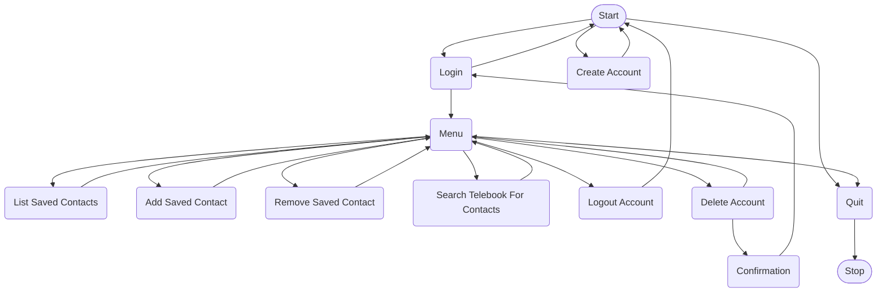

## Telebook
For the Programming for Security Professionals (ITT-310) course at [Grand Canyon University](https://gcu.edu), students must create a simple CLI application using the C programming language. The requirements for the CLI application are as follows: implements modular code, can enter and exit the CLI application, features a menu, has basic error handling, and utilizes user-defined functions. To complete this assignment, I created Telebook, a simple contact management application. 

### Disclaimer

Before this course, I had never developed with the C programming language. With this in mind, please understand that this application may not implement the best practices of the C programming language. Up until this point, I have been a hobbyist programmer for almost five years, so I attempted to implement the best practices from other languages such as Python with the C programming language. Yet, there is no guarantee that the following application is secure or bug-free. If you encounter a bug in the application, feel free to submit an Issue and I will attempt to fix it as soon as possible. Thanks for understanding. 

### Usage

The Telebook application was strictly developed with Windows support in mind. This application should run on Unix, but support is not guaranteed. To run this application, download the latest version from the release tab. Then, double-click on the `Telebook.exe` file. Alternatively, the following command can be run in `cmd.exe` to start the application. 
```sh
./Telebook.exe
```

### Flowchart

The following flowchart aims to illustrate the logical design flow of the CLI application. This flowchart was employed to plan the structure of the nested menus found within Telebook.



### Features

The following aims to give a technical overview of the features implemented in Telebook. For an in depth explanation of the Telebook application, you can watch my video explanation [here](https://youtu.be/qouURvWnlMg).

- Persistent Data Storage: Telebook utilizes a .data file to binary dump the struct array from memory. This occurs every time a user is added or removed from the application and when a contact is added or removed from a user account.
- DJB2 Hashing Algorithm: No application should ever store plaintext passwords! Considering this application is for a class that focuses on cybersecurity principles, Telebook utilizes a simple hashing algorithm named [DJB2](http://www.cse.yorku.ca/~oz/hash.html) to illustrate the basic concept of password hashing. Telebook accomplishes this task by storing password hashes rather than plaintext passwords. It must be noted, that DJB2 is an insecure cryptographic function. No one should ever use this algorithm in a production environment, **ever**!
- User-Friendly Interface: The rudimentary User Interfaces (UIs) are a major downside to CLI applications. Telebook aims to provide users with a simplistic, user-friendly design. To accomplish this, inspiration was sourced from the design elements of [Bootstrap's Color Utility Class](https://getbootstrap.com/docs/5.3/utilities/colors/#colors). With Bootstrap, specific colors are linked with a specific status. For example, a successful action is marked with the color green. Telebook uses this concept throughout the UI to provide a clean and user-friendly experience. Several colors were implemented into the UI using ANSI escape codes. Additionally, various ASCII characters were used to implement unique branding and menu dividers.

## License
[Telebook](https://github.com/connorgillespie/Telebook) © 2019 by [Connor Gillespie](https://github.com/connorgillespie) is licensed under [CC BY 4.0](https://creativecommons.org/licenses/by/4.0/?ref=chooser-v1)  

